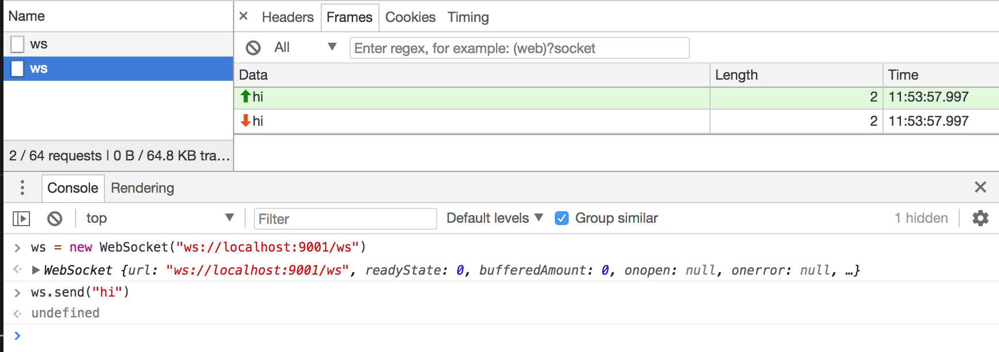

# Simple WebSocket library for nim.

* Based on the work by niv https://github.com/niv/websocket.nim
* Also see rfc https://tools.ietf.org/html/rfc6455

## Example Echo Server:

Example echo server, will repeat what you send it:

```nim
import ws, asyncdispatch, asynchttpserver

var server = newAsyncHttpServer()
proc cb(req: Request) {.async.} =
  if req.url.path == "/ws":
    var ws = await newWebSocket(req)
    await ws.send("Welcome to simple echo server")
    while ws.readyState == Open:
      let packet = await ws.receiveStrPacket()
      await ws.send(packet)
  await req.respond(Http200, "Hello World")

waitFor server.serve(Port(9001), cb)
```

And then in the browser type this JavaScript:

```js
ws = new WebSocket("ws://localhost:9001/ws")
ws.send("hi")
```




## Example Chat Server:

Example chat server, will send what you send to connected all clients.

```nim
import ws, asyncdispatch, asynchttpserver

var connections = newSeq[WebSocket]()

proc cb(req: Request) {.async, gcsafe.} =
  if req.url.path == "/ws":
    try:
      var ws = await newWebSocket(req)
      connections.add ws
      await ws.send("Welcome to simple chat server")
      while ws.readyState == Open:
        let packet = await ws.receiveStrPacket()
        for other in connections:
          if other.readyState == Open:
            asyncCheck other.send(packet)
    except IOError:
      echo "socket closed"
  await req.respond(Http200, "Hello World")

var server = newAsyncHttpServer()
waitFor server.serve(Port(9001), cb)
```

In one tab:
```js
ws = new WebSocket("ws://localhost:9001/ws")
ws.send("How are you?")
```

Other tab:
```js
ws = new WebSocket("ws://localhost:9001/ws")
ws.send("Good, you?")
```

## Example client socket:

Instead of being the server you are the client connecting to some other server:

```nim
var ws = await newWebSocket("ws://127.0.0.1:9001/ws")
echo await ws.receiveStrPacket()
await ws.send("Hi, how are you?")
echo await ws.receiveStrPacket()
ws.close()
```

SSL is also supported:
```nim
var ws = await newWebSocket("wss://echo.websocket.org")
```

You can also pass a protocol
```nim
var ws = await newWebsocket("wss://echo.websocket.org", protocol = "alpha")
```

## Using with Jester

If you use using `ws` with `jester` library you need to import jester_extra:

```nim
import jester
import ws, ws/jester_extra

routes:
  get "/ws": 
    var ws = await newWebSocket(request)
    await ws.send("Welcome to simple echo server")
    while ws.readyState == Open:
      let packet = await ws.receiveStrPacket()
      await ws.send(packet)
```
# API: ws

```nim
import ws
```

## **type** ReadyState


```nim
ReadyState = enum
  Connecting = 0, Open = 1, Closing = 2, Closed = 3
```

## **type** WebSocket


```nim
WebSocket = ref object
  req*: Request
  version*: int
  key*: string
  protocol*: string
  readyState*: ReadyState

```

## **type** WebSocketError


```nim
WebSocketError = object of Exception
```

## **proc** newWebSocket

Creates a new socket from a request.

```nim
proc newWebSocket(req: Request): Future[WebSocket] {.async, raises: [WebSocketError].}
```

## **type** Opcode

4 bits. Defines the interpretation of the "Payload data".

```nim
Opcode = enum
  Cont = 0x00000000,            ## denotes a continuation frame
  Text = 0x00000001,            ## denotes a text frame
  Binary = 0x00000002,          ## denotes a binary frame
  Close = 0x00000008,           ## denotes a connection close
  Ping = 0x00000009,            ## denotes a ping
  Pong = 0x0000000A             ## denotes a pong
```

## **proc** send

This is the main method used to send data via this WebSocket.  

```nim
proc send(ws: WebSocket; text: string; opcode = Opcode.Text): Future[void] {.async, raises: [WebSocketError], tags: [WriteIOEffect, ReadIOEffect].}
```

## **proc** receivePacket

Wait for a string or binary packet to come in.

```nim
proc receivePacket(ws: WebSocket): Future[(Opcode, string)] {.async, raises: [WebSocketError].}
```

## **proc** receiveStrPacket

Wait only for a string packet to come. Errors out on Binary packets.

```nim
proc receiveStrPacket(ws: WebSocket): Future[string] {.async, raises: [WebSocketError].}
```

## **proc** receiveBinaryPacket

Wait only for a binary packet to come. Errors out on string packets.

```nim
proc receiveBinaryPacket(ws: WebSocket): Future[seq[byte]] {.async, raises: [WebSocketError].}
```

## **proc** ping

Sends a ping to the other end, both server and client can send a ping. Data is optional.

```nim
proc ping(ws: WebSocket; data = "") {.async.}
```

## **proc** setupPings


```nim
proc setupPings(ws: WebSocket; seconds: float) 
```

## **proc** hangup

Closes the Socket without sending a close packet

```nim
proc hangup(ws: WebSocket) 
```

## **proc** close

Close the Socket, sends close packet.

```nim
proc close(ws: WebSocket) 
```

